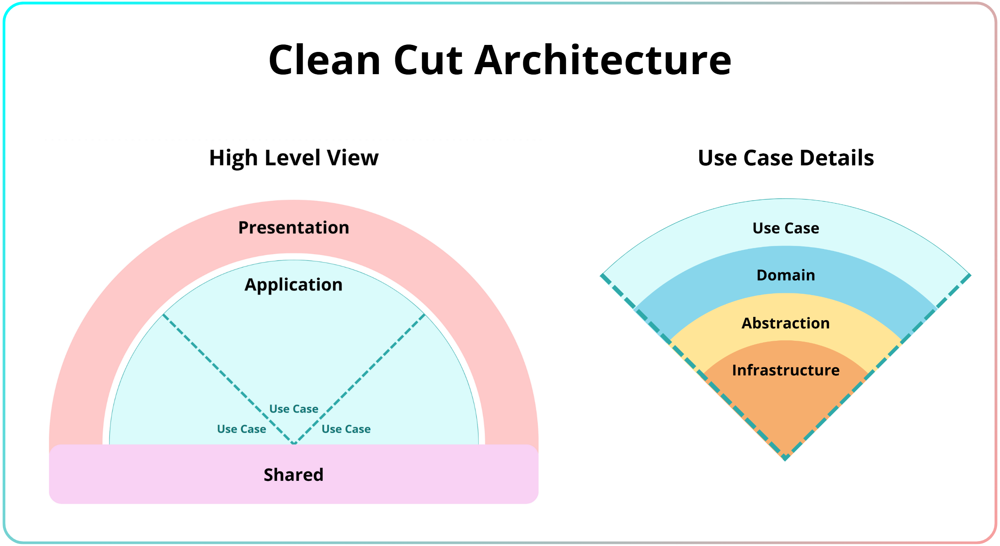

<h1 align="center">
   <strong>Clean Cut Architecture</strong>
</h1>
<h3 align="center">
   <strong>Slicing Use Cases with Intent</strong>
</h3>

   Let's build something clean, simple and effective—one slice at the time!

---

Welcome to **Clean Cut Architecture (CCA)!** Over my years as a .NET engineer, I've been inspired by the structured approach of Clean Architecture and the simplicity of Vertical Slice Architecture. I often found myself blending the two approaches into something that worked better for my projects-something I now call Clean Cut Architecture. This approach is designed to help developers build intuitive, maintainable, and purpose-driven systems.

## **Why Clean Cut Architecture**

Software design can be messy. Over time, tangled dependencies, unclear boundaries, and overly complex architectures turn even the best projects into headaches. CCA aims to fix that by:

1. **Defining Clear Boundaries**:

   - Separate your application into distinct zones (or "boundaries") with well-defined roles.
   - Keep your business logic insulated from the messiness of presentation layers and infrastructure.

2. **Embracing Purposeful Simplicity**:

   - Build systems as a collection of purposeful "cuts"—Use Cases that represent specific business operations.
   - Focus on the "why" of your system, not just the "how."

3. **Blending the Best Practices**:
   - Use the structural discipline of Clean Architecture.
   - Add the practicality of Vertical Slice Architecture.

## **What Does CCA Look Like?**

Imagine your system as a series of cleanly cut slices, each with its own well-defined purpose:

- **Application _(Core Boundary)_:** The beating heart of your system. This is where the magic happens—Use Cases that encapsulate your business logic.

- **Presentation _(Interface Boundary)_:** The external-facing part—APIs, UIs, and everything that connects your system to the outside world.

- **Shared _(Cross-Cutting Concerns)_:** Shared utilities like logging, validation, or configuration—organized and controlled.

### **Visualizing the Architecture**

To give you a better picture, here is the visual representation of the architecture:

The **High Level View** illustrates the design of CCA:

- **Presentation** sits at the top, where user-facing interactions occur.
- **Application** lies beneath, broken into purposeful Use Cases that handle business logic.
- **Shared** forms the foundation, providing utilities like logging and configuration for the entire system.

The **Use Case Internals** zooms into the **Application Boundary**, showing how a Use Case is structured. It highlights:

- **Domain**: Business rules and aggregates.
- **Abstraction**: Interfaces and contracts that guide communication.
- **Infrastructure**: Concrete implementations like databases and APIs.

## **Quick Start**

Want to get started? Here's what you'll find in this repository:

- **[/documentation](/documentation/README.md):**
  Dive into the nitty-gritty of Clean Cut Architecture. From its guiding principles to practical implementations, this is where you'll learn what makes CCA tick.

- **[/templates](/templates/README.md):**
  Ready to jump in? Start with our project templates and hit the ground running with CCA.

- **[/examples](/examples/README.md):**
  See CCA in action with real-world examples designed to inspire and guide you.

## **How Does It All Work?**

Clean Cut Architecture aims to standarize the system's workflow. This workflow keeps the focus on the Use Case, with it being the entry point into the Application's business rules and orchestrating the necessary components to accomplish it's goal.

To help you understand how everything comes together, here's a visual workflow of how multiple kinds of incoming requests can be handled in the same fashion, but with different internal components accomplishing the purpose of the request.

   

The Architecture Workflow maps the journey of a request through Clean Cut Architecture. Every use case will use different specially tailored components for the use case itself. These components can be of many types - including but not limited to Domain, Abstraction and Infrastructure.

- **From Presentation**: A consumer (UI or API client) initiates the request, handled by a Presentation component.
- **Through Application**: The request flows into a Use Case, leveraging Domain, Abstraction, and Infrastructure to process the logic.
- **Backed by Shared**: Shared components provide cross-cutting support to help the request accomplish its goal effectively.

## **Ready to Cut to the Chase?**

Clean Cut Architecture is more than just a set of rules—it's a way of thinking about software design. If you've ever felt bogged down by overly complex systems, unclear responsibilities, or just the general messiness of software development, CCA might just be the change you're looking for.

Head over to the **[/documentation](/documentation/README.md)** folder to learn the building blocks of Clean Cut Architecture and start designing systems you'll enjoy working with.

## Roadmap

- ☑️ Set up repository and first ReadMe.
- ☑️ Initial documentation on principles and concepts.
- ☑️ Add a starter project template.
- ☐ Provide more real-world examples.
- ☐ Create guides for integrating CCA into existing systems.
- ☐ Open the project for community feedback and contributions.

## Contributing

For now, this repository is a **work in progress**, but feel free to open issues for suggestions or ideas. Contributions will be welcomed in the future.

---

 

<h3 align="center">
   Happy Coding!
</h3>
<h6 align="center">
   <i>0.2.0-beta</i>
</h6>
