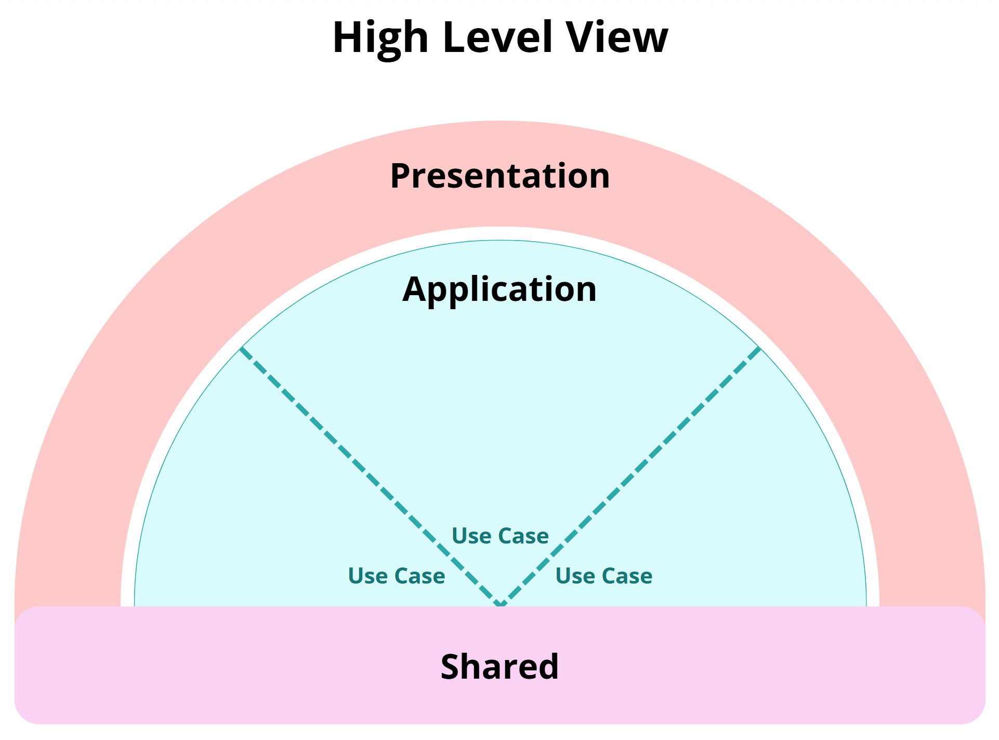

# **Chapter II - Clean Cut Architecture**

### Table of Contents

1. [Introduction](#1-introduction)
2. [High-Level View](#2-high-level-view)
3. [Foundational Pillars](#3-foundational-pillars)
4. [Principles of Clean Cut Architecture](#4-principles-of-clean-cut-architecture)

## 1. **Introduction**

Clean Cut Architecture is more than just another pattern—it’s a philosophy. At its core, it’s about bringing clarity to our systems, both in how they are structured and how they are understood. This philosophy tackles a common challenge in software development: codebases becoming overly complex and difficult to maintain as they evolve. By adopting the principles of Clean Cut Architecture, we aim to build systems that are not only robust but also intuitive to navigate and adapt.

But what does “Clean Cut” truly mean? The name itself carries a dual meaning, each reflecting a cornerstone of the architecture’s design.

### **Clearly Defined Boundaries**

The first meaning of “Clean Cut” highlights the sharp division between the Application and Presentation boundaries. This separation is foundational: Application and Presentation are distinct entities, each with clearly defined roles and responsibilities.

This isn’t just about organization—it’s a statement of intent. The Application boundary houses the business logic: the core rules and operations that define the system’s purpose. It’s designed to be agnostic of external interfaces, free from dependencies on how the system is delivered to the world.

On the other hand, the Presentation boundary is where interaction happens. It handles how the system communicates with users, APIs, or other external actors. By isolating these concerns, we achieve clarity, maintainability, and adaptability. It becomes easier to introduce changes to the interface without fear of breaking the core logic—and vice versa.

This principle of separation ensures that the system’s structure mirrors its purpose. It’s about creating a stable foundation where the roles of each part are unmistakable.

### **A Cleanly Cut Application**

The second meaning takes “Clean Cut” deeper. It’s not just about dividing Application and Presentation—it’s about how the Application itself is “cut” into smaller, purposeful pieces. These cuts represent Use Cases: self-contained units of behavior, each serving a specific purpose.

A Use Case acts as the driving force behind the Application. It defines what the system does, breaking down the business intent into focused, manageable components. Behind every Use Case lies a cohesive set of supporting elements:

- Domain: The business rules that form the heart of the Use Case.
- Abstraction: Contracts and boundaries that ensure flexibility and modularity.
- Infrastructure: Implementation details that support the Use Case without polluting its core logic.

What’s remarkable about this approach is how these Use Cases come together. Individually, they serve distinct purposes. Collectively, they form a cohesive whole that screams the purpose of the Application. This clarity makes the Application easier to understand, reason about, and evolve over time.

---

### **Making It Easier to Decide**

This dual meaning of “Clean Cut” serves another critical purpose: helping developers know where things belong. It answers the common question: “Where should I put this new component?”
The answer lies in the context:

1. **What Use Case is the component supporting?**
2. **Does the component interact with the outside world?**

These two questions alone narrow the scope significantly. Instead of debating its place in the entire project, you’re working within a much smaller, well-defined context.

And here’s the beauty of it: this placement isn’t permanent. As you refine your design and improve your organization, components may shift. A component might move between directories inside a Use Case or even transition between boundaries. That’s fine—because the guiding principle remains clear. It belongs to a Use Case, and that Use Case is part of the Application.

This flexibility, grounded in clarity, is what makes Clean Cut Architecture not just a pattern, but a philosophy for building systems that stand the test of time.

---

By embracing the two meanings of “Clean Cut”—Clearly Defined Boundaries and A Cleanly Cut Application—we create systems that are intuitive, maintainable, and purpose-driven. These principles provide a solid foundation for the chapters ahead, where we’ll dive deeper into the structure of Clean Cut Architecture and explore how Use Cases bring it all together.

## 2. **High-Level View**

To understand the structure of Clean Cut Architecture at a glance, consider the following high-level diagram:

The diagram illustrates the architecture's core components and their interactions:

- **Application _(Core Boundary)_:** The beating heart of your system. This is where the magic happens—Use Cases that encapsulate your business logic. This boundary houses Use Cases, each representing a distinct purpose, collectively driving the system’s overall functionality.

- **Presentation _(Interface Boundary)_:** The external-facing boundary that connects your system to the outside world, including APIs, UIs, and other communication interfaces. This boundary manages external interactions while shielding the Application from direct dependencies.

- **Shared _(Cross-Cutting Concerns)_:** Utilities and components that operate across boundaries, following strict dependency rules. Examples include logging utilities, error types, configuration settings, database connections, and other reusable tools that support the system's infrastructure.

This visual acts as a foundational reference throughout the guide, helping you contextualize the architecture's components and principles as they are explored in subsequent sections.

## 3. **Foundational Pillars**

The essence of Clean Cut Architecture rests on a few unshakable pillars—concepts that shape its philosophy and guide its practical implementation. These pillars are not arbitrary; they are deliberate choices designed to create systems that are clear, adaptable, and enduring.

### **Separation of Concerns**

Why does Clean Cut Architecture draw such a sharp line between Presentation and Application? It's not because mixing them always leads to disaster—there are plenty of systems out there that do just fine without this separation. But "just fine" isn't the goal here; we want to go beyond just creating software that works—we want software that stands the test of time—software that _feels_ right. That is, we want to build a system that works, is clear, adaptable, and easy to maintain.

Let's start with Presentation. This boundary isn't just about exposing endpoints or handling requests—it's often the hub for a wide range of responsibilities: setup (dependency injection, configuration), network concerns (CORS policies, ports, infrastructure wiring), handling incoming requests (middlewares), and even health-checking. Presentation components have a lot to handle already, and combining these responsibilities with the Application's Use Cases can muddy the waters and obscure our business rules. Imagine reading a novel in a noisy café—you can, but wouldn't it be nicer to read in peace?

The Application boundary, by contrast, is where the business logic lives. It safely stays behind its boundary to remain unburdened by the details of how it's presented to the outside world. It doesn't care if your users interact via API endpoints or events. This separation ensures that Use Cases remain the clear drivers of functionality. By separating the Application, we keep its purpose intact, free from the noise of Presentation concerns.

Now, let's talk about flexibility. What happens when your system needs to support multiple ways of exposing its functionality? Maybe some Use Cases power a Web API, others are deployed as CLI tools, while others respond to event triggers or even gRPC endpoints. Keeping Presentation concerns separate from Application makes this kind of flexibility not only possible but manageable. Each Presentation boundary can focus on its job without stepping on the Application's toes.

And here's another critical benefit: reduced cognitive exhaustion. When you're writing a Use Case, you don't have to think about things like endpoint URLs or middleware configuration. That's not your problem—at least, not yet. Instead, you can focus on what actually matters: the purpose of the software. This singular focus leads to sharper design and allows your Use Cases to help you drive the shape of everything else—including how Presentation components are going to look later on.

Having these two boundaries also makes testing strategies clearer and broader. The Application can be tested with a full suite of unit and integration tests, and even more. We can mock Application dependencies on multiple levels—all at once like unit tests, or just a couple of them to test a critical integration. Presentation can also be tested on different levels, from simulating different Application responses and scenarios and how it reacts to them, to full end-to-end and regression tests.

Is separating these concerns always necessary, though? Maybe not. Every project has unique demands, and you might get away without it. But by keeping them separated, you benefit from clarity, flexibility, and maintainability—qualities that become invaluable as systems grow and change. Reduce the risk of a tangled mess sneaking up on you!

### **Use Case-Centric Design**

If Separation of Concerns establishes the borders, Use Case-Centric Design is the map inside. It’s the approach that ensures every piece of functionality has a clear and deliberate home.

Each Use Case then represents a specific piece of functionality—a purpose that contributes to the overall mission of the system. By organizing the Application around these Use Cases, we make its purpose unmistakably clear. The structure isn’t just modular; it’s intentional. For example, a "CreateUser" Use Case handles the logic for registering a new user in the system, including validating input, persisting the user to the database, and sending a welcome email.

This design philosophy shifts the focus away from generic, layered systems toward purpose-driven organization. Use Cases are not just an implementation detail; they are the primary lens through which the Application boundary is structured and understood. If you find yourself asking, "Where does this logic belong?" the answer is simple: What Use Case does it serve? Use Cases become the guiding star, keeping functionality focused and eliminating the sprawling complexity that often plagues large codebases.

By organizing functionality around Use Cases, we ensure that the system’s intent is always front and center. This clarity not only benefits developers working within the system but also communicates its purpose to stakeholders and new team members.

### **Cohesion Over Complexity**

In software, complexity often sneaks in unnoticed. Complex structures sprawl out of nowhere all the time; they creep into our codebase, making it a tangled web of interdependencies. Segregated logic is a common problem. It makes it difficult to find all the pieces related to a single feature, and developers are often unsure whether they can safely make changes. Clean Cut Architecture counters this with an emphasis on cohesion: grouping related components together based on the Use Case they serve.

But cohesion doesn't just make things easier to find—it keeps them meaningful. Every component, from Domain rules, Abstracted boundaries, and supporting Infrastructure, exists in the context of its Use Case. There's less guesswork, no unnecessary scattering of responsibilities. It's also about reducing the cognitive load for developers, stopping the hunt for missing components.

The result? A system that's not only easier to understand but also easier to maintain. When changes come—and they always do—you know exactly where to look and what to adjust. And your teammates! Teammates reviewing your code can see exactly what you changed and where, what use cases you updated and why. Cohesion isn't just about grouping things together—it's about making sure they _belong_ together. This deliberate organization keeps the system intentional. Clean doesn't mean basic; it means purposeful.

## 4. **Principles of Clean Cut Architecture**

The principles of Clean Cut Architecture build upon its foundational pillars, offering practical guidance to developers. They transform philosophy into action, ensuring that the architecture not only looks good on paper but also works effectively in practice.

### **Screaming Intent**

The structure of your architecture should make its purpose unmistakable. This principle, borrowed from Clean Architecture, emphasizes the importance of naming and organizing your codebase so that it communicates the system’s intent at a glance.

- **Purposeful Structure:** Use namespaces, directories, and file structures that clearly represent the system’s Use Cases.

- **Clarity Over Complexity:** Avoid unnecessary abstractions that obscure intent. For instance, a directory named `OrderProcessing` is far clearer than one named `BusinessLogicModule1` or `Helpers`.

- **Immediate Understanding:** Any developer should be able to open the project and quickly understand its purpose and function.

This isn’t just about aesthetics—it’s about making your codebase accessible and intuitive, whether you’re onboarding new team members or revisiting a project months later.

### **High Cohesion**

High Cohesion, inspired by Vertical Slice Architecture, ensures that everything related to a specific Use Case resides in the same place. Controllers, validation logic, domain entities—if they contribute to the same functionality, they should be together.

Why? Because scattering related components across the project creates confusion and unnecessary dependencies. High Cohesion creates clarity by reducing the distance between where a concept is defined and where it is implemented.

- **Centralized Logic**: Keep all components tied to a single Use Case within the same module or folder.

- **Reduced Cognitive Load**: Developers should not need to jump between layers or distant files to understand a single functionality.

- **Practical Example**: For an `OrderManagement` Use Case, store the controller, validation rules, and domain logic within an `OrderManagement` module instead of scattering them across unrelated folders.

This principle minimizes confusion, reduces unnecessary dependencies, and enhances the maintainability of your codebase.

### **Deferred Implementation**

Premature decisions are the enemy of flexibility. Deferred Implementation, a principle derived from Clean Architecture, reminds us to focus on the core logic of Use Cases before diving into technical details like database schemas or API endpoints.
By deferring these decisions, you keep the system adaptable and avoid locking yourself into choices that may later prove limiting. This principle encourages developers to build for the “what” before the “how.”

- **Focus on Core Logic**: Start by defining what the system needs to do (the “what”), not how it will do it (the “how”).

- **Delay Commitment**: Postpone decisions on frameworks, libraries, or infrastructure until they’re absolutely necessary.

- **Build for Adaptability**: By keeping the system’s core independent, you maintain the freedom to adapt to changing requirements or technologies.

For example, instead of designing your Use Case around a specific database, build it around abstractions that allow you to decide later, when you have more information, what is the appropriate storage technology to use.

### **Delayed Sharing**

Not everything needs to be shared right away—or at all. In Clean Cut Architecture, components must demonstrate their value across multiple Use Cases before being moved into shared spaces.

This principle guards against premature abstraction, which often leads to unnecessary dependencies and increased complexity. Delayed Sharing ensures that the system remains cohesive, with shared components representing only what truly belongs across boundaries.

- **Earned Abstraction**: Only move components into shared modules when there’s clear evidence they’re needed in multiple contexts.

- **Avoid Premature Generalization**: Resist the urge to generalize logic too early, as this often creates unnecessary dependencies, even stepping into over-engeenering grounds.

- **Practical Example**: If two Use Cases share similar validation logic because their inputs looks similar-resist temptation of creating a single validation logic for both with a switch inside! Keep the logic local to each until it’s clear a shared abstraction will save time and reduce complexity, maybe only validating truly shared values before moving on to exclusive ones.

This principle prevents bloated shared modules and ensures that shared components are truly valuable and relevant. **Sharing privileges are earned, not given.**

### **Intentional Error Design**

Errors are inevitable, but they don’t have to be chaotic. Intentional Error Design makes error handling an integral part of Use Case logic rather than an afterthought.

- **Error Ownership**: Use Cases should define a specific suite of errors that encapsulate potential failure scenarios. This makes the Use Case's boundaries and capabilities explicit, just like its business logic.

- **Predictable Behavior**: Errors provide insight into the Use Case's design by outlining the failure paths it anticipates. For example, an OrderProcessing Use Case might expose errors like InvalidOrderDetails, InsufficientInventory, or PaymentFailure.

- **Actionable Errors**: By defining errors alongside Use Cases, you give a fuller picture of what the application does and how it responds when things go wrong. This ensures that the system is not just a black box but a well-defined contract for consumers.

For instance, if a messaging endpoint encounters InvalidOrderDetails, it can skip retries because the error implies a malformed input. Similarly, the Presentation layer can distinguish between errors like InsufficientInventory (which might prompt a 409 Conflict) and PaymentFailure (which could lead to user intervention).

This principle elevates errors to first-class citizens of your architecture, making them as much a part of the system’s story as its Use Cases. It fosters better communication, stronger system resilience, and clearer system intent.

---

By following these principles, Clean Cut Architecture ensures that systems remain focused, maintainable, and adaptable over time. Each principle serves as a compass, guiding developers to make decisions that prioritize clarity, simplicity, and purpose.

 
 

[Next Chapter: Structure of Clean Cut Architecture](../3-structure-of-cca/README.md)

---

[Previous Chapter: Introduction](../README.md)

---
