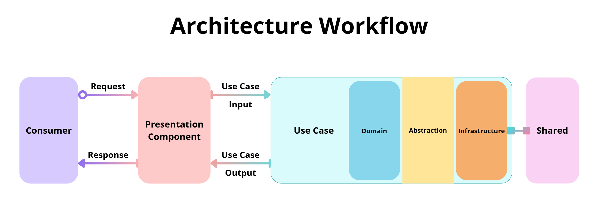

# Chapter III - Structure of Clean Cut Architecture

### Table of Contents

1. [The Three Boundaries](#1-the-three-boundaries)
2. [The Flow of Data and Dependencies](#2-the-flow-of-data-and-dependencies)

Imagine building a puzzle: each piece has a defined shape, purpose, and place, yet all must fit together seamlessly to complete the picture. That’s how Clean Cut Architecture (CCA) works—but instead of cardboard pieces, we’re assembling boundaries, components, and workflows.

At its core, the structure of CCA isn’t just a set of rules; it’s a blueprint for creating software systems that are simple, intuitive, maintainable, and adaptable. Let’s break it down piece by piece.

## 1. **The Three Boundaries**

In Chapter II - Clean Cut Architecture, we have talked about the three boundaries that govern this approach. Let's take a closer look into the details of each of them, and how together they help create a simple and powerful system.

### **The Application Boundary**

The Application boundary is organized into Use Cases, each divided further into layers:

- **Domain:** Represents the business core—entities, aggregates, or simple rules.
- **Abstraction:** Defines contracts and interfaces for external dependencies.
- **Infrastructure:** Implements those contracts and connects to the real world (databases, APIs, etc.).

### **The Presentation Boundary**

The Presentation boundary is all about translating communication. It can take many forms:

- An API controller interpreting HTTP requests.
- A message handler consuming events from a queue.
- A CLI parsing user commands.

Regardless of form, its job is to act as a translator—cleaning and formatting incoming requests before passing them to the Application boundary and returning the response in a way that makes sense to the outside world.

### **The Shared Boundary**

Shared components don’t belong to a specific Use Case or boundary. Instead, they’re tools for everyone:

- Error types to enforce consistent error handling.
- An ORM context for database interactions.
- Messaging components for inter-service communication.

These are reusable and flexible, but only when used correctly. Remember: Shared concerns **support** boundaries—they never dictate them.

## 2. **The Flow of Data and Dependencies**

CCA enforces a one-way dependency rule: data flows inward, decisions flow outward.

1. The Presentation boundary **receives** requests from external consumers.
2. It transforms those requests into something the Application boundary understands.
3. The Application boundary **processes** the request, leveraging Domain logic, Abstractions, and Infrastructure.
4. Results flow back to the Presentation boundary, which formats them for the external consumer.

### **Putting It All Together**

Here’s where the _Architecture Workflow_ graphic comes in.

It visualizes this flow from Presentation to Application to Shared, showing how everything fits together. Every component has its place, and every boundary plays its part.

### **Why This Structure Works**

The structure of CCA isn’t arbitrary; it’s designed to solve real-world problems:

- **Understandability:** Each boundary has a clear role. When something breaks, you know where to look.
- **Flexibility:** Changing one boundary (e.g., swapping a database or UI) doesn’t ripple through the system.
- **Maintainability:** Smaller, focused components are easier to test, debug, and enhance.

---

### **A Final Thought**

The structure of CCA isn’t a limitation—it’s a guide. It gives you the freedom to focus on building features, solving problems, and writing clean, efficient code. With a clear structure in place, you can stop worrying about the “how” and start focusing on the “what.”
