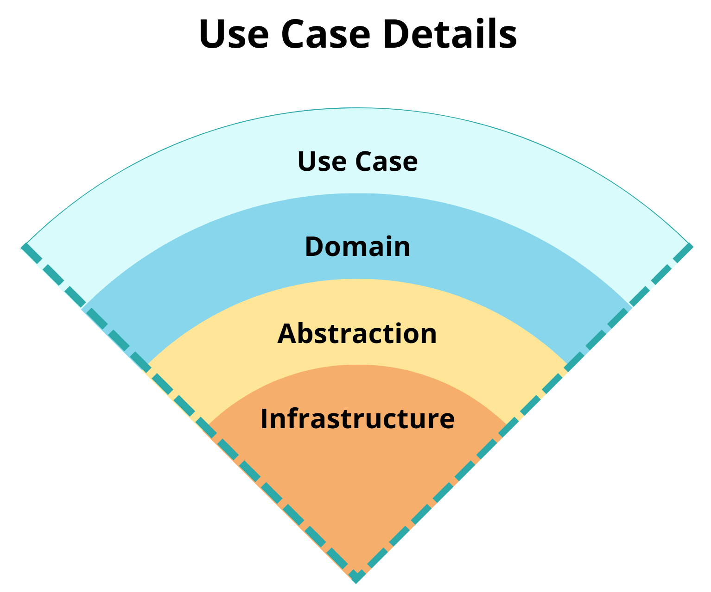
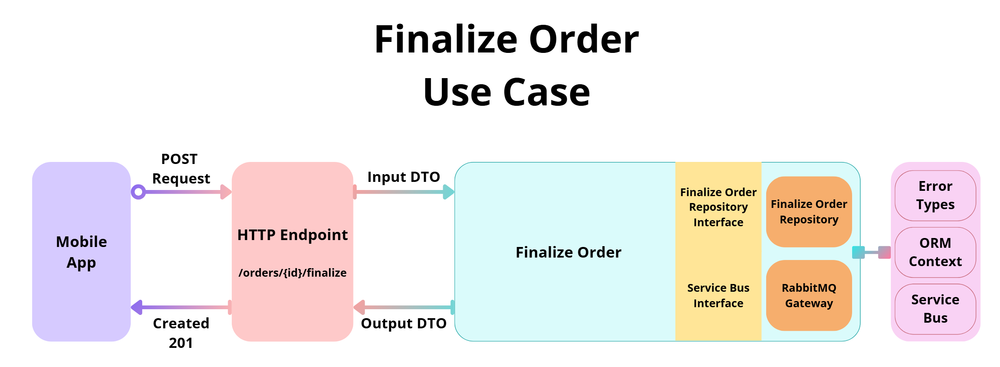
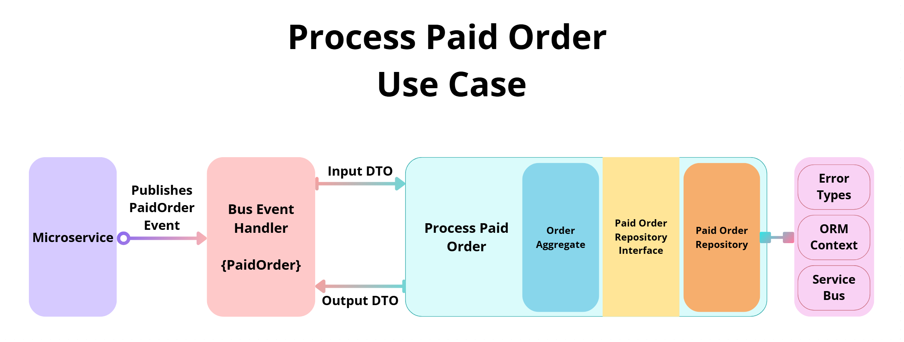

# **Chapter IV: The Use Case**

### **Table of Contents**

1. [What is a Use Case in CCA?](https://www.notion.so/Chapter-IV-The-Use-Case-176462e65f92800f8541cd374930f991?pvs=21)
2. [The Anatomy of a Use Case](https://www.notion.so/Chapter-IV-The-Use-Case-176462e65f92800f8541cd374930f991?pvs=21)
3. [Use Cases in Action](https://www.notion.so/Chapter-IV-The-Use-Case-176462e65f92800f8541cd374930f991?pvs=21)
4. [Key Principles of Use Cases](https://www.notion.so/Chapter-IV-The-Use-Case-176462e65f92800f8541cd374930f991?pvs=21)

At the heart of Clean Cut Architecture (CCA) lies the **Use Case**—a foundational building block that encapsulates the **what** of your application. Use Cases give purpose to your system, acting as self-contained units of business logic, and driving clarity, independence, and adaptability. Every component plays a supporting role to ensure the use cases fulfill their purpose.

## 1. **What is a Use Case in CCA?**

In Clean Cut Architecture, a Use Case represents a **single, focused operation** or workflow. It’s not just code—it’s the **business logic in action**, distilled into a pure, testable form.

**Key Characteristics of a Use Case:**

- **Focus:** Each Use Case is responsible for **one thing** and one thing only.
- **Isolation:** It’s completely unaware of external systems like databases or APIs.
- **Predictability:** Inputs and outputs are well-defined and consistent.

### **Use Cases as the Heart of the Application**

Whether it’s **finalizing an order**, **resetting a password**, or **processing a payment**, every meaningful operation in your system should map to a Use Case. The **Application boundary** exists solely to house and orchestrate these Use Cases.

## 2. **The Anatomy of a Use Case**

A Use Case can be thought of as a **well-organized pipeline**, with each part playing a distinct role. Let’s break it down:

### **Core Components of a Use Case**

1. **Input Handling:**
   - Accepts inputs from the Presentation boundary (e.g., DTOs or commands).
   - Validates these inputs to ensure correctness and integrity.
2. **Business Logic:**
   - The heart of the Use Case—this is where decisions are made and rules are enforced.
   - Leverages business-related logic code, domain entities and aggregates to perform meaningful operations.
3. **Interaction with Dependencies:**
   - Utilizes abstractions (e.g., repositories or services) to interact with external systems.
   - Keeps infrastructure details hidden behind interfaces or shared utilities.
4. **Output Handling:**
   - Produces clear, predictable outputs (e.g., DTOs or events) for the Presentation boundary.

### **Layered Organization of a Use Case**

Visually a Use Case would resemble an inverted cone, with the following orchestrated internal components:
Visually, a Use Case resembles an **inverted cone**, with layers that lfow from high-level orchestration to detail implementation. Each set of components is crafted to maintain clarity, flexibility, and modularity.

  

<i>Use Case Details: Visualizing the internal structure of a Use Case.</i>

0. **The Use Case Component:**

   The Use Case component serves as a **Business Logic zone**, acting as the brain of the operation:

   - **Core Responsability:** It defines and drives the flow of operations needed to accomplish the Use Case's purpose.
   - **Encapsulation of Logic:** Rather than relying on dedicated Domain components like entitites or aggregates, the Use Case itself can own and manage its domain logic.
   - **Delegate When Needed:** For more complex operations, the Use Case can delegate specific tasks to reusable Domain Components that encapsulate intricate business rules.
   - **Creator of Domain Concerns:** The Use Case often instantiates and orchestrates the lifecycle of Domain components, ensuring they remain tightly coupled to the purpose of the Use Case.

   This dual role-**owning logic directly and delegating complexity as needed**-allows the Use Case to adapt to both siple and complex workflows without over-engineering.

1. **Domain Components:**

   Domain Components exist to **support the Use Case** by handling more specialized business logic.

   - **Optional but Powerful:** If a Use Case requires sophisticated validations, calculations, rules, aggregations, etc. these Domain Components encapsulate the logic to keep the Use Case itself focused on orchestration.
   - **Reusable Knowledge:** Domain Components can also provide reusable logic across multiple Use Cases, but their primary allegiance is always to the Use Case's needs.

   In simpler systems, the Use Case may directly implement all logic, making explicit Domain Components unnecessary.

2. **Abstraction Components:**

   Abstractions Components aim to bridge the Use Case to external resources while maintaining isolation:

   - **Defined Interfaces:** Provides contracts for interacting with external systems (e.g., `IOrderRepository`, `IPaymentService`).
   - **Enforces Decoupling:** Protects the Use Case from changes in infrastrucure or external system implementations.

3. **Infrastructure Components:**

   Infrastructure Components implement Abstractions, making the Use Case functional in real-world scenarios:

   - **Concrete Implementations:** Implements interfaces for external systems (e.g., repositories, API gateways).
   - **Flexible Placement:** While initially implemented directl within the Use Case for simplicity, they can be moved to a Shared zone for broader reuse as the system grows.

### **The Versatile Role of the Use Case**

By allowing the Use Case act as both the **owner of business logic** and the **orchestrator of Domain components**, Clean Cut Architecture strikes a balance:

1. For simple workflows, the Use Case itself can handle all logic directly, avoiding unnecessary complexity.
2. For complex scenarios, the Use Case collaborates with Domain Components to manage intricate business requirements, without losing sight of the overall orchestration.

This approach ensures that the Use Case remains both **focused on its purpose** and **adaptable to evolving requirements.** It also avoids the pitfalls of overengineering while maintaning a clear structure for future growth.

## 3. **Use Cases in Action**

Let’s bring the concept to life with examples.

### **Example 1: Finalizing an Order (HTTP-Driven Workflow)**

Imagine a user submits an order via a mobile app. Here’s how the Use Case handles it:

  

<i>Finalize Order Use Case: Demonstrates an HTTP-driven Use Case workflow.</i>

1. **Input:**
   - The Presentation boundary receives the HTTP request, validates it, and converts it into an input DTO (e.g., `FinalizeOrderUseCaseInput`).
2. **Processing:**
   - The Use Case performs business logic, ensuring the order meets all requirements before finalizing.
   - It might interact with:
     - A **repository** to persist the order.
     - A **service bus** to notify other systems (e.g., shipping or invoicing).
3. **Output:**
   - The Use Case returns an output DTO (e.g., `FinalizeOrderUseCaseResult`) to the Presentation boundary, which formats it for the user.

---

### **Example 2: Processing a Paid Order (Event-Driven Workflow)**

Not all Use Cases are request-response. Event-driven workflows can also be leveraged around Use Cases too.

  

<i>Process Paid Order Use Case: An event-driven example of a Use Case workflow.</i>

Here’s how it works:

1. **Input:**
   - A microservice publishes a `PaidOrder` event, which is caught by the Presentation boundary (e.g., a message handler).
   - The handler transforms the event into an input DTO.
2. **Processing:**
   - The Use Case verifies the payment, build a proper domain Order , updates the order status, and triggers related actions (e.g., notifying shipping).
3. **Output:**
   - Results may include emitting new events (e.g., `OrderProcessed`) or simply updating the database.

## 4. **Key Principles of Use Cases**

### **1. Single Responsibility**

A Use Case does one thing and does it well. It doesn’t concern itself with external systems or presentation details—it focuses solely on the business logic.

### **2. Testability**

Because a Use Case relies on Abstraction Components, it can be tested in isolation. Mock dependencies (like repositories) and test the core logic with confidence.

### **3. Independence from Boundaries**

Use Cases don’t care about **how** inputs arrive or outputs are consumed. Whether it’s an API, a CLI, or an event bus, the Use Case remains the same.

### **4. Explicit Contracts**

Inputs and outputs are well-defined through DTOs, making the Use Case predictable and easy to work with.

### **5. Reusability**

By keeping logic encapsulated, Use Cases can be reused in different contexts (e.g., the same Use Case could power both an API and a batch job).

## **Why Use Cases Matter**

Without Use Cases, your application becomes a **tangled mess of scattered logic**. By organizing around Use Cases, you achieve:

- **Clarity:** A clear mapping of business operations to code.
- **Scalability:** Easily add new features without disrupting existing logic.
- **Maintainability:** Focused, testable components that evolve gracefully.

### **The Core of CCA**

The Use Case isn’t just a pattern—it’s the essence of Clean Cut Architecture. By placing business logic at the center and protecting it with clear boundaries, you create a system that’s **intuitive, adaptable, and durable**.

The Use Case is where Clean Cut Architecture shines. It’s not just a phylosophy; it’s a practice — one that makes your application easier to understand, maintain, and grow.

 
 

[Next Chapter: Questions and Answers](../5-questions-and-answers/README.md)

---

[Previous Chapter: Structure of Clean Cut Architecture](../3-structure-of-cca/README.md)

---
